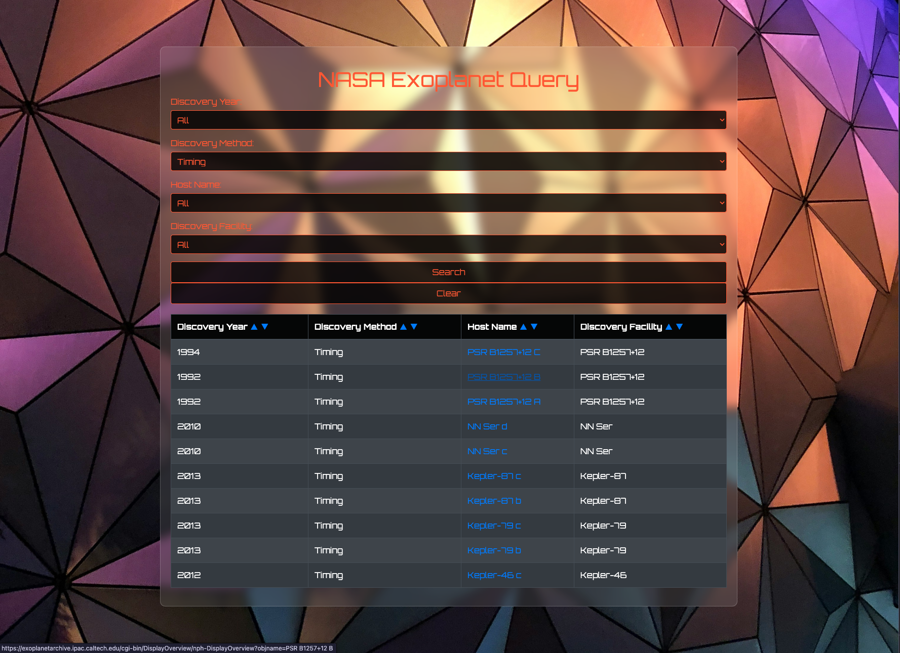

# NASA Exoplanet Query Application 🚀

This web application allows users to query a dataset of exoplanets from the NASA Exoplanet Archive. Users can search by
discovery year, discovery method, host star name, and discovery facility. The results are displayed in a user-friendly
table. ✨

## Features

* **Searchable Database:** Query the NASA Exoplanet Archive data by:
    * Discovery Year 📅
    * Discovery Method 🔭
    * Host Star Name ⭐
    * Discovery Facility 📡
* **Clear Search:** Reset search parameters and clear results. 🧹
* **Input Validation:** Prevents searches with no criteria selected. ✅
* **Result Display:** Presents search results in a clear, organized table. 📊
* **Hyperlinks:** Host star names are hyperlinked to the NASA Exoplanet Archive's Confirmed Planet Overview Page for
  that planet, opening in a new tab. 🔗
* **Sorting:** Sort results ascending or descending by each column (Discovery Year, Discovery Method, Host Name,
  Discovery Facility). ⬆️⬇️
* **Responsive Design:** Adapts to different screen sizes. 📱💻
* **Modern Styling:** Uses Bootstrap for a clean and visually appealing interface. ✨
* **Progress Indicator:** Displays a progress bar while processing search requests (using NProgress). 进度条

## Technologies Used

* **Python:** Backend logic and API creation. 🐍
* **Flask:** Web framework for Python. 🌶️
* **Pandas:** Data manipulation and analysis library for Python. 🐼
* **HTML, CSS, JavaScript:** Frontend development. 🌐
* **Bootstrap:** CSS framework for responsive design. Bootstrap
* **NProgress:** JavaScript library for displaying progress bars. NProgress 📊

<h2 align="center">📈 GitHub Stats 📈</h2>

 

## Support

If you like this project, consider buying me a coffee:

